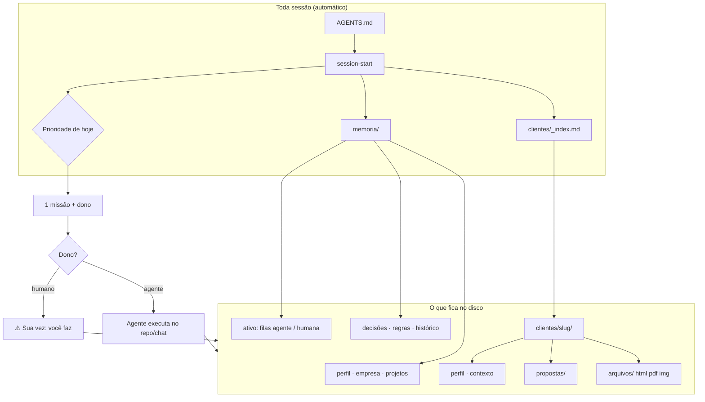
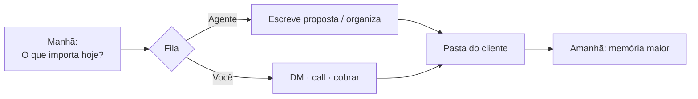

# INVOS

**A IA que conhece teu negócio — e de manhã diz por onde começar.**

Sistema de memória multi-agente em arquivos: quem você é, clientes, prazos, prioridades e **quem faz o quê** (você ou o agente).  
Não te trata como estranho. Não devolve “produtividade genérica”.

| | |
|--|--|
| **Comprar / página** | [inovadigitalid.com/invos](https://inovadigitalid.com/invos) · **R$97** · pagamento único |
| **Como chega** | Kit em **ZIP** (Hotmart) — o ZIP é o frete; o valor é o **sistema** |
| **Ativar** | Abra a pasta no agente e diga: *“Segue o [COMECE-AQUI.md](./COMECE-AQUI.md)”* |

---

## O problema em um desenho

```text
  VOCÊ                         IA SEM MEMÓRIA
    │                                │
    │  "Quem eu sou, o que vendo,    │
    │   cliente X, o que decidimos…" │
    ├───────────────────────────────►│
    │                                │  responde ok…
    │◄───────────────────────────────┤
    │                                │
    │         [ fecha o chat ]       │
    │                                │
    │  amanhã: tudo de novo          │  "Em que posso ajudar?"
    ├───────────────────────────────►│  (zero contexto)
```

Isso não é “usar mal a IA”. É IA **sem cérebro do negócio**.

---

## O que o INVOS faz (mesmo desenho, depois)

```text
  VOCÊ              PASTA INVOS (no disco)              IA (Claude/Cursor/…)
    │                      │                                  │
    │  "O que importa      │  lê memoria/ + clientes/         │
    │   hoje?"             │  + filas com dono                │
    ├─────────────────────►│─────────────────────────────────►│
    │                      │                                  │
    │◄─────────────────────┴──────────────────────────────────┤
    │   "Prioridade: proposta Clínica Vida (sexta).           │
    │    Dono: eu redijo; você envia. Quer que eu escreva?"   │
    │                                                         │
    │  [ fecha o chat ]                                       │
    │  amanhã, outro agente, outro PC…                        │
    │  mesma pasta = mesmo cérebro                            │
```

**Em uma frase:** o INVOS é o **sistema de contexto** do teu negócio. Ativa uma vez; a memória **compõe**. Proposta e cliente no teu tom, sem reexplicar.

---

## Como o sistema se encaixa (mapa)



Leitura de leigo:

1. **memoria/** = cérebro (você + empresa + o que fazer hoje).  
2. **clientes/** = um cliente por pasta + um **índice** da fila comercial.  
3. **Dono da task** = se o agente pode fazer sozinho, ele faz; se só você pode (DM, call, cobrar), ele **grava e te avisa**.

---

## Os 3 wows (o que você sente)

### 1 — Manhã: por onde começar

| Sem INVOS | Com INVOS |
|-----------|-----------|
| “Depende… quais são seus projetos?” | “Prioridade: proposta Clínica Vida. Depois follow-up Beta. **Dono: agente redige / você envia.** Quer que eu escreva?” |

### 2 — Segunda sessão: não é estranho

Chat **novo**, mesma pasta:

> “Quem eu sou e no que estou trabalhando?”  
> → responde com **os teus** dados. Sem re-entrevista.

### 3 — Cliente certo + proposta no teu tom

```text
Você:  Gera proposta pro ana-studio: landing, 2 semanas, R$3.500
INVOS: lê tua marca + pasta da Ana
       → HTML pronto em clientes/ana-studio/propostas/….html
       → mensagem de WhatsApp/e-mail pra copiar
       → ⚠️ Sua vez: enviar (abrir HTML / PDF e mandar)
```

Claude, Cursor, Codex, Gemini, Grok… **mesma pasta = mesmo cérebro.**

---

## Fluxo do dia a dia (prestador)



| Você digita | O que acontece |
|-------------|----------------|
| `O que importa hoje?` | 1 prioridade + **dono** + próximo passo |
| `Cria o cliente ana-studio: …` | Copia template + linha no `_index` |
| `Cliente atual: ana-studio` | Contexto **dela**, sem misturar |
| `Gera proposta pro ana-studio: …` | Arquivo em `propostas/` + te avisa se o próximo passo é teu |
| `Salva esse PDF na pasta do cliente X` | Vai pra `clientes/X/arquivos/` |

---

## Toda task tem dono (anti-fila eterna)

```text
┌─────────────────────┐         ┌─────────────────────┐
│   FILA AGENTE       │         │   FILA HUMANA       │
│   (executa sozinho) │         │   (só você)         │
├─────────────────────┤         ├─────────────────────┤
│ redigir proposta    │         │ enviar DM de verdade│
│ atualizar ficha     │         │ ligar / fechar      │
│ organizar arquivos  │         │ decidir preço final │
│ rascunho de post    │         │ pagar / assinar     │
└─────────────────────┘         └─────────────────────┘
         │                                │
         ▼                                ▼
   faz e grava                    grava + ⚠️ Sua vez:
```

Pendência **sempre** com data (`desde`). Se passar de ~3 dias, o boot **cobra**.

---

## O que tem dentro da pasta

```text
teu-negocio-invos/
├── COMECE-AQUI.md      ← ligar o sistema (agente executa)
├── AGENTS.md           ← regras multi-harness (fonte da verdade)
├── MEMORY.md           ← mapa curto do cérebro
├── memoria/            ← cérebro do negócio
│   ├── perfil.md · empresa.md · projetos.md · ativo.md
│   └── decisoes · insights · regras · historico
├── marca/              ← identidade visual (proposta lê daqui)
│   ├── marca.md        ← cores, voz, contato
│   └── assets/         ← logo.png / logo.svg
├── clientes/
│   ├── _index.md       ← pipeline + valor + pagto
│   ├── _template/
│   └── ana-studio/
│       ├── perfil · contexto · entregas
│       ├── propostas/  ← HTML pronto
│       └── arquivos/
├── conteudo/           ← fila de post (opcional)
├── integracoes/        ← opcional (Composio CLI)
│   └── composio/
└── .agents/skills/     ← session-*, onboard, proposta, design-marca, social-content
```

| Em português | Path |
|--------------|------|
| Cérebro digital | `memoria/` |
| Fila comercial | `clientes/_index.md` |
| Um cliente | `clientes/<slug>/` |
| Proposta gerada | `clientes/<slug>/propostas/` |
| Arquivos do cliente | `clientes/<slug>/arquivos/` |
| Como o agente opera | `AGENTS.md` |
| Setup | `COMECE-AQUI.md` |

### Core (é o produto)

- Memória em `memoria/`  
- **Marca** em `marca/` (cores, voz, logo) + skill **design-marca**  
- Clientes: `_index` (valor + pagto) + pasta por cliente  
- Tasks com dono (agente vs humano)  
- Loop de sessão + onboard  
- Skill **proposta** (HTML com brand)  
- Marketing: skill **social-content** (texto) + squad **instagram-carrossel** (fábrica PNG)  
- Opcional: `integracoes/composio/`  

### Bônus estratégia (não é produção de feed)

Squads advisory-board, brand, hormozi. Brand → `marca/marca.md`.

---

## Começar (3 minutos até o wow)

```mermaid
flowchart LR
  Z[Baixa ZIP] --> R[Renomeia pasta]
  R --> A[Abre no agente]
  A --> O[Onboard]
  O --> W["Chat novo:\nQuem eu sou…"]
  W --> 🎉[Wow]
```

1. Baixe o kit (ZIP Hotmart) e extraia.  
2. **Renomeie** a pasta (ex.: `studio-ana-invos`) — isso **é** o teu sistema.  
3. Abra no Cursor / Claude / Codex / Grok / OpenCode…  
4. *“Segue o COMECE-AQUI”* ou *“Ativa o INVOS / roda o onboard”*.  
5. Responda **uma pergunta por vez**.  
6. **Teste:** chat novo → *“Quem eu sou e no que estou trabalhando?”*  
7. Prestador: *“Cria o cliente …”* → *“Gera proposta…”*.

```bash
unzip invos-kit.zip -d ~/meu-invos
cd ~/meu-invos && mv invos-kit meu-negocio-invos && cd meu-negocio-invos
# abra esta pasta no agente
```

Zero Node/Docker pro core. Sistema = **pasta + agente**.

Guia completo: **[COMECE-AQUI.md](./COMECE-AQUI.md)**.

---

## Prova em 3 minutos

| # | Ação | Sucesso |
|---|------|---------|
| 1 | Pasta aberta no agente | — |
| 2 | Onboard | `memoria/` sem “PREENCHA” |
| 3 | **Nova** sessão | — |
| 4 | “Quem eu sou e no que estou trabalhando?” | Responde com **seus** dados |
| 5 | “O que importa hoje?” | 1 prioridade + dono |
| 6 | Cria cliente + proposta | Arquivo em `clientes/…/propostas/` + linha no `_index` |

Se o passo 4 falhar, o resto não importa — arrume a memória primeiro.

```bash
bash scripts/validar.sh              # estrutura do kit
bash scripts/validar.sh --pos-onboard  # memória preenchida?
```

---

## Pra quem é

- Cansa de **reexplicar** o negócio toda sessão  
- Presta serviço e joga **vários clientes** na mesma IA  
- Quer **prioridade do dia + proposta** sem montar stack de engenheiro  
- Está começando no Cursor / Claude / terminal  

**Não precisa programar.** Abre a pasta e conversa.

---

## Site e compra

| | |
|--|--|
| **Página** | https://inovadigitalid.com/invos |
| **Preço** | R$97 (pagamento único, Hotmart) |
| **O que compra** | Sistema: memória multi-agente + clientes + proposta + loop de sessão + bônus |
| **Entrega** | Kit **ZIP** |
| **Garantia** | 7 dias (conforme a página) |

Já comprou? Baixe o kit → **[COMECE-AQUI.md](./COMECE-AQUI.md)**.

---

## Trabalhar de qualquer lugar

1. O sistema inteiro está na **pasta**.  
2. Copia pro outro PC (ou git).  
3. Abre em outro agente → **mesma memória**, mesmos clientes, mesmas propostas.

Não é login em SaaS. É o teu negócio estruturado pra IA usar de verdade.

---

## O que o INVOS **não** é

- Não é “só um ZIP” (ZIP = frete; produto = sistema)  
- Não é curso com aulas  
- Não é Notion / app na nuvem  
- Não é “instalar 50 ferramentas”  
- Não é second brain infinito — é **execução** (prioridade, cliente, proposta)

v1 = memória (wow) + clientes + proposta + filas com dono.  
v2 = mais workflows, sem abandonar a simplicidade.

---

## Segurança (30 segundos)

- **Não** coloque senha, token ou chave em `memoria/` nem no Git.  
- Use `.env` local se precisar (já no ignore).  
- [SECURITY.md](./SECURITY.md)

---

## Dúvidas rápidas

**Preciso saber programar?** Não.  
**Só Claude?** Não — qualquer agente que leia a pasta.  
**Errei no onboard?** “Atualiza minha oferta em empresa.md para…”.  
**Onde compro?** https://inovadigitalid.com/invos  

---

## Licença

MIT — use e adapte no seu fluxo.

---

*Produto da INV · [inovadigitalid.com/invos](https://inovadigitalid.com/invos)*
