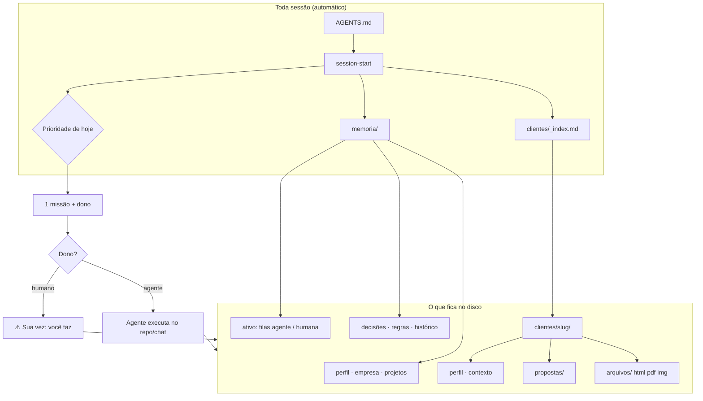
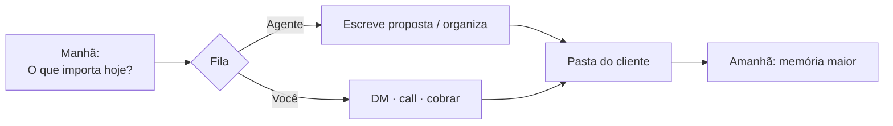

# INVOS

**A IA que conhece teu negócio — e de manhã diz por onde começar.**

Sistema de memória multi-agente em arquivos: quem você é, clientes, prazos, prioridades e **quem faz o quê** (você ou o agente).  
Não te trata como estranho. Não devolve “produtividade genérica”.

| | |
|--|--|
| **Comprar / página** | [inovadigitalid.com/invos](https://inovadigitalid.com/invos) · **R$97** · pagamento único |
| **Como chega** | Kit em **ZIP** (Hotmart) — o ZIP é o frete; o valor é o **sistema** |
| **Ativar** | Abra a pasta no agente e diga: *“Segue o [COMECE-AQUI.md](./COMECE-AQUI.md)”* |

---

## Core do dia a dia (só isto)

| Você digita | O sistema faz |
|-------------|----------------|
| `O que importa hoje?` | 1 prioridade + dono (você ou agente) |
| `Proposta pro [cliente]: …` | HTML pronto + texto de envio + ⚠️ você manda |
| `Post / legenda …` | Texto na sua voz (`marca/`) — skill **social-content** |
| `Faz um carrossel: [tema]` | **MVP:** 1–2 slides HTML + caption (PNG opcional) |
| `Resumo do e-mail do cliente X` / Gmail | Skill **google-workspace** (nativa, sem CLI extra) |
| `fim` | Arquiva a sessão |

**Resto** (fábrica full de carrossel, Notion, wiki de pesquisa, site estilo Stripe, Ikigai, squads, Composio…) = **só se você pedir**.  
Detalhe do setup: [COMECE-AQUI.md](./COMECE-AQUI.md).

---

## Casos de uso (é aqui que a ficha cai)

Casos de uso = “isso parece o meu dia”. Se você se reconhece numa linha, o INVOS serve.

### Manhã de prestador (qualquer nicho)

| Situação real | O que você fala | O que sai |
|---------------|-----------------|-----------|
| Acordou sem saber o que atacar | *“O que importa hoje?”* | 1 prioridade + **dono** (você ou o agente) + próximo passo |
| Chat novo, outro agente, outro PC | *“Quem eu sou e no que estou trabalhando?”* | Responde com **teus** dados — sem re-entrevista |
| Lead pediu orçamento ontem | *“Proposta pro ana-studio: landing, 2 semanas, R$3.500”* | HTML com **tua marca** + texto de WhatsApp + ⚠️ *você* envia |
| Cliente pagou | *“Cliente ana-studio pagou”* | Atualiza pipeline (`_index`), entregas, o que vem depois |

### Vários clientes na mesma IA (sem misturar)

| Situação real | O que você fala | O que sai |
|---------------|-----------------|-----------|
| Novo cliente na conversa | *“Cria o cliente clinica-vida: …”* | Pasta `clientes/clinica-vida/` + linha no `_index` |
| Volta pro projeto da Ana | *“Cliente atual: ana-studio”* | Contexto **dela** (não da clínica) |
| PDF / print / contrato da call | *“Salva isso na pasta do cliente X”* | Vai pra `clientes/X/arquivos/` — não some no chat |

### Conteúdo sem virar agência

| Situação real | O que você fala | O que sai |
|---------------|-----------------|-----------|
| Precisa postar e não tem idea genérica | *“O que posto essa semana?”* / *“Legenda LinkedIn sobre …”* | Texto na voz da **tua** `marca/` (skill **social-content**) |
| Quer carrossel no IG, rápido | *“Faz um carrossel: 5 erros na proposta comercial”* | Pack HTML + caption em `conteudo/carrosseis/` — você sobe no app |
| Quer fábrica com research e ângulos | *“Fábrica completa de carrossel: [tema]”* | Pipeline squad (mais longo; opcional) |

### Empresário digital que “faz tudo com agente”

| Situação real | O que você fala | O que sai |
|---------------|-----------------|-----------|
| Caixa de entrada lotada | *“O que chegou de importante no Gmail hoje?”* | Skill **google-workspace** — resposta com base no teu e-mail |
| Pesquisa pra cliente (concorrente, preço, tendência) | *“Pesquisa X e guarda no wiki / na pasta do cliente”* | Skill **llm-wiki** + opcionalmente `clientes/<slug>/` |
| Precisa de site ou página “bonita de verdade” | *“Landing estilo Linear pro meu serviço”* | Skill **popular-web-designs** (sistemas reais: Stripe, Linear, Vercel…) |
| Pitch / reunião amanhã | *“Monta um PPTX com a oferta e prova social”* | Skill **powerpoint** + dados de `memoria/` / cliente |
| Notion como CRM ou base | *“Atualiza a página do cliente X no Notion”* | Skill **notion** (nativa) |
| Mac: task na cabeça | *“Cria lembrete: cobrar Beta sexta 10h”* | Skill **apple-reminders** |
| Travado na oferta (sua ou do cliente) | *“Roda ikigai nessa ideia de produto”* | Skill **pd-ikigai** — estratégia, não só “ideia de startup” |

### Estratégia e branding (bônus, sob demanda)

| Situação real | O que você fala | O que sai |
|---------------|-----------------|-----------|
| Decisão difícil de negócio | *“Chama o advisory board nessa decisão”* | Squad **advisory-board** (mentes/frameworks) — grava insight se valer |
| Marca fraca ou site sem identidade | *“Extrai a marca do meu site …”* | Skill **design-marca** → `marca/marca.md` + assets |
| Posicionamento mais fundo | *“Roda o squad brand”* | Squad **brand** → resumo de volta em `marca/` |

### O que **não** é caso de uso do INVOS

- App SaaS com login na nuvem (é **pasta no teu disco**)  
- “Instala 50 ferramentas e configura MCP o dia todo” (core = pasta + agente)  
- Pedir mapa/POI (use Google Maps; skill maps **não** entra no kit)  
- Misturar “só legenda” com “carrossel com slides” — são skills **diferentes** (texto vs pack visual)

---

## O problema em um desenho

```text
  VOCÊ                         IA SEM MEMÓRIA
    │                                │
    │  "Quem eu sou, o que vendo,    │
    │   cliente X, o que decidimos…" │
    ├───────────────────────────────►│
    │                                │  responde ok…
    │◄───────────────────────────────┤
    │                                │
    │         [ fecha o chat ]       │
    │                                │
    │  amanhã: tudo de novo          │  "Em que posso ajudar?"
    ├───────────────────────────────►│  (zero contexto)
```

Isso não é “usar mal a IA”. É IA **sem cérebro do negócio**.

---

## O que o INVOS faz (mesmo desenho, depois)

```text
  VOCÊ              PASTA INVOS (no disco)              IA (Claude/Cursor/…)
    │                      │                                  │
    │  "O que importa      │  lê memoria/ + clientes/         │
    │   hoje?"             │  + filas com dono                │
    ├─────────────────────►│─────────────────────────────────►│
    │                      │                                  │
    │◄─────────────────────┴──────────────────────────────────┤
    │   "Prioridade: proposta Clínica Vida (sexta).           │
    │    Dono: eu redijo; você envia. Quer que eu escreva?"   │
    │                                                         │
    │  [ fecha o chat ]                                       │
    │  amanhã, outro agente, outro PC…                        │
    │  mesma pasta = mesmo cérebro                            │
```

**Em uma frase:** o INVOS é o **sistema de contexto** do teu negócio. Ativa uma vez; a memória **compõe**. Proposta e cliente no teu tom, sem reexplicar.

---

## Como o sistema se encaixa (mapa)



Leitura de leigo:

1. **memoria/** = cérebro (você + empresa + o que fazer hoje).  
2. **clientes/** = um cliente por pasta + um **índice** da fila comercial.  
3. **Dono da task** = se o agente pode fazer sozinho, ele faz; se só você pode (DM, call, cobrar), ele **grava e te avisa**.

---

## Os 3 wows (o que você sente)

### 1 — Manhã: por onde começar

| Sem INVOS | Com INVOS |
|-----------|-----------|
| “Depende… quais são seus projetos?” | “Prioridade: proposta Clínica Vida. Depois follow-up Beta. **Dono: agente redige / você envia.** Quer que eu escreva?” |

### 2 — Segunda sessão: não é estranho

Chat **novo**, mesma pasta:

> “Quem eu sou e no que estou trabalhando?”  
> → responde com **os teus** dados. Sem re-entrevista.

### 3 — Cliente certo + proposta no teu tom

```text
Você:  Gera proposta pro ana-studio: landing, 2 semanas, R$3.500
INVOS: lê tua marca + pasta da Ana
       → HTML pronto em clientes/ana-studio/propostas/….html
       → mensagem de WhatsApp/e-mail pra copiar
       → ⚠️ Sua vez: enviar (abrir HTML / PDF e mandar)
```

Claude, Cursor, Codex, Gemini, Grok… **mesma pasta = mesmo cérebro.**

---

## Fluxo do dia a dia (prestador)



| Você digita | O que acontece |
|-------------|----------------|
| `O que importa hoje?` | 1 prioridade + **dono** + próximo passo |
| `Cria o cliente ana-studio: …` | Copia template + linha no `_index` |
| `Cliente atual: ana-studio` | Contexto **dela**, sem misturar |
| `Gera proposta pro ana-studio: …` | Arquivo em `propostas/` + te avisa se o próximo passo é teu |
| `Salva esse PDF na pasta do cliente X` | Vai pra `clientes/X/arquivos/` |
| `O que chegou de importante no Gmail?` | Skill google-workspace |
| `Faz um carrossel: …` | MVP em `conteudo/carrosseis/` |

Mais cenários na seção **[Casos de uso](#casos-de-uso-é-aqui-que-a-ficha-cai)** acima.

---

## Toda task tem dono (anti-fila eterna)

```text
┌─────────────────────┐         ┌─────────────────────┐
│   FILA AGENTE       │         │   FILA HUMANA       │
│   (executa sozinho) │         │   (só você)         │
├─────────────────────┤         ├─────────────────────┤
│ redigir proposta    │         │ enviar DM de verdade│
│ atualizar ficha     │         │ ligar / fechar      │
│ organizar arquivos  │         │ decidir preço final │
│ rascunho de post    │         │ pagar / assinar     │
└─────────────────────┘         └─────────────────────┘
         │                                │
         ▼                                ▼
   faz e grava                    grava + ⚠️ Sua vez:
```

Pendência **sempre** com data (`desde`). Se passar de ~3 dias, o boot **cobra**.

---

## O que tem dentro da pasta

```text
teu-negocio-invos/
├── COMECE-AQUI.md      ← ligar o sistema (agente executa)
├── AGENTS.md           ← regras multi-harness (fonte da verdade)
├── MEMORY.md           ← mapa curto do cérebro
├── memoria/            ← cérebro do negócio
│   ├── perfil.md · empresa.md · projetos.md · ativo.md
│   └── decisoes · insights · regras · historico
├── marca/              ← identidade visual (proposta lê daqui)
│   ├── marca.md        ← cores, voz, contato
│   └── assets/         ← logo.png / logo.svg
├── clientes/
│   ├── _index.md       ← pipeline + valor + pagto
│   ├── _template/
│   └── ana-studio/
│       ├── perfil · contexto · entregas
│       ├── propostas/  ← HTML pronto
│       └── arquivos/
├── conteudo/           ← fila de post + carrosseis/
├── integracoes/        ← opcional (Composio: redes/apps extras)
│   └── composio/
├── .agents/skills/     ← canônico (Codex, OpenCode, Grok, Gemini…)
│   ├── session-* · onboard · proposta · design-marca
│   ├── social-content · instagram-carrossel (pack único)
│   ├── productivity/ (gmail, notion, pptx, ocr…)
│   ├── llm-wiki · popular-web-designs · pd-ikigai · apple/*
│   └── …
└── .claude/skills/     ← symlinks pro Claude Code (mesmo conteúdo)
```

| Em português | Path |
|--------------|------|
| Cérebro digital | `memoria/` |
| Fila comercial | `clientes/_index.md` |
| Um cliente | `clientes/<slug>/` |
| Proposta gerada | `clientes/<slug>/propostas/` |
| Arquivos do cliente | `clientes/<slug>/arquivos/` |
| Como o agente opera | `AGENTS.md` |
| Setup | `COMECE-AQUI.md` |
| Skills (todas as harnesses) | `.agents/skills/` |
| Skills (Claude Code) | `.claude/skills/` → symlink |

### Core (é o produto)

- Memória em `memoria/` + loop de sessão + onboard  
- **Marca** em `marca/` + skill **design-marca**  
- Clientes: `_index` (valor + pagto) + pasta por cliente + **dono** da task  
- Skill **proposta** (HTML com brand)  
- Conteúdo: **social-content** (texto) + **instagram-carrossel** (MVP visual; full opcional)  
- Operação do empresário: **google-workspace** (Gmail…), **notion**, pptx/ocr/pdf  
- Pesquisa e entrega: **llm-wiki**, **popular-web-designs**, **pd-ikigai**  
- macOS: **apple-notes** / **apple-reminders**  
- Multi-harness: `.agents/skills` + symlinks `.claude/skills`  

### Bônus estratégia (não é produção de feed)

Squads **advisory-board**, **brand**, **hormozi**. Brand → `marca/marca.md`.  
**Composio** = Instagram/TikTok/Telegram etc. — **não** substitui a skill nativa de Gmail.

---

## Começar (3 minutos até o wow)

```mermaid
flowchart LR
  Z[Baixa ZIP] --> R[Renomeia pasta]
  R --> A[Abre no agente]
  A --> O[Onboard]
  O --> W["Chat novo:\nQuem eu sou…"]
  W --> 🎉[Wow]
```

1. Baixe o kit (ZIP Hotmart) e extraia.  
2. **Renomeie** a pasta (ex.: `studio-ana-invos`) — isso **é** o teu sistema.  
3. Abra no Cursor / Claude / Codex / Grok / OpenCode…  
4. *“Segue o COMECE-AQUI”* ou *“Ativa o INVOS / roda o onboard”*.  
5. Responda **uma pergunta por vez**.  
6. **Teste:** chat novo → *“Quem eu sou e no que estou trabalhando?”*  
7. Prestador: *“Cria o cliente …”* → *“Gera proposta…”*.

```bash
unzip invos-kit.zip -d ~/meu-invos
cd ~/meu-invos && mv invos-kit meu-negocio-invos && cd meu-negocio-invos
# abra esta pasta no agente
```

Zero Node/Docker pro core. Sistema = **pasta + agente**.

Guia completo: **[COMECE-AQUI.md](./COMECE-AQUI.md)**.

---

## Prova em 3 minutos

| # | Ação | Sucesso |
|---|------|---------|
| 1 | Pasta aberta no agente | — |
| 2 | Onboard | `memoria/` sem “PREENCHA” |
| 3 | **Nova** sessão | — |
| 4 | “Quem eu sou e no que estou trabalhando?” | Responde com **seus** dados |
| 5 | “O que importa hoje?” | 1 prioridade + dono |
| 6 | Cria cliente + proposta | Arquivo em `clientes/…/propostas/` + linha no `_index` |

Se o passo 4 falhar, o resto não importa — arrume a memória primeiro.

```bash
bash scripts/validar.sh              # estrutura do kit
bash scripts/validar.sh --pos-onboard  # memória preenchida?
```

---

## Pra quem é

- Cansa de **reexplicar** o negócio toda sessão  
- Presta serviço e joga **vários clientes** na mesma IA  
- Quer **prioridade do dia + proposta** sem montar stack de engenheiro  
- Empresário **digital** que usa agente pra Gmail, pesquisa, site do cliente, post e call  
- Está no Cursor / Claude / Codex / Grok / OpenCode / Gemini / Antigravity…  

**Não precisa programar.** Abre a pasta e conversa.  
Se algum **caso de uso** da seção acima parece o teu dia — é pra ti.

---

## Site e compra

| | |
|--|--|
| **Página** | https://inovadigitalid.com/invos |
| **Preço** | R$97 (pagamento único, Hotmart) |
| **O que compra** | Sistema: memória multi-agente + clientes + proposta + loop de sessão + bônus |
| **Entrega** | Kit **ZIP** |
| **Garantia** | 7 dias (conforme a página) |

Já comprou? Baixe o kit → **[COMECE-AQUI.md](./COMECE-AQUI.md)**.

---

## Trabalhar de qualquer lugar

1. O sistema inteiro está na **pasta**.  
2. Copia pro outro PC (ou git).  
3. Abre em outro agente → **mesma memória**, mesmos clientes, mesmas propostas.

Não é login em SaaS. É o teu negócio estruturado pra IA usar de verdade.

---

## O que o INVOS **não** é

- Não é “só um ZIP” (ZIP = frete; produto = sistema)  
- Não é curso com aulas  
- Não é Notion / app na nuvem  
- Não é “instalar 50 ferramentas”  
- Não é “só Notion com chat” — Notion/Gmail são **skills opcionais** em cima do cérebro em arquivo  
- Não troca Google Maps (endereço/rota) — isso fica no app do humano  

**Promessa:** execução com contexto (prioridade, cliente, proposta) + ferramentas do dia a dia do empresário digital, **sob demanda** (não no boot).

---

## Segurança (30 segundos)

- **Não** coloque senha, token ou chave em `memoria/` nem no Git.  
- Use `.env` local se precisar (já no ignore).  
- [SECURITY.md](./SECURITY.md)

---

## Dúvidas rápidas

**Preciso saber programar?** Não.  
**Só Claude?** Não — qualquer agente que leia a pasta.  
**Errei no onboard?** “Atualiza minha oferta em empresa.md para…”.  
**Onde compro?** https://inovadigitalid.com/invos  

---

## Licença

MIT — use e adapte no seu fluxo.

---

*Produto da INV · [inovadigitalid.com/invos](https://inovadigitalid.com/invos)*
